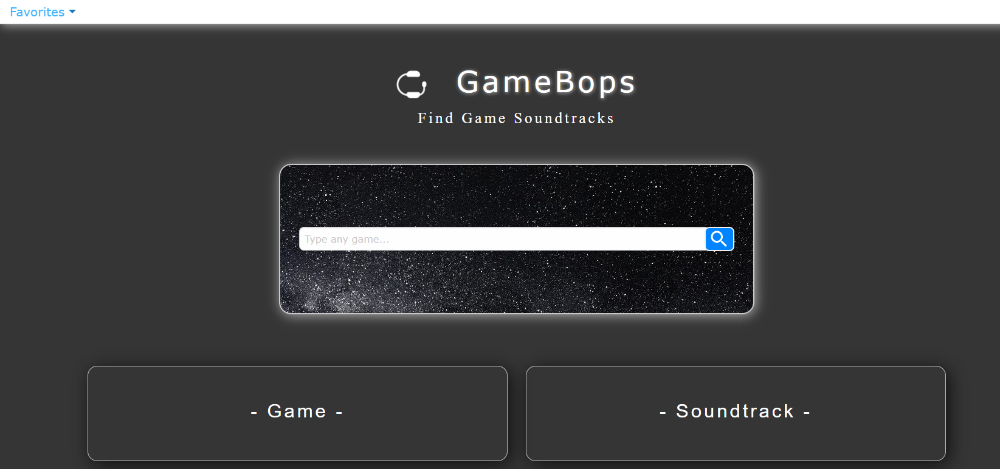

# GameBops

The development of this application aimed to help strengthen and expand our teams knowledge of CSS and javascript by working with multiple server-side api's. During this process we implemented agile development methods, git branch workflow and pull requests to keep our project work organised and efficient.

The goal of GameBops is to deliver a way for fans of games and music to find and save their favorite gaming soundtracks with a easy-to-use interface and search method. The api's we used include the Deezer api for finding music, the RAWG api for a game database and the freetogame api for a list of recommended free games. Other tools that were used in the development of the CSS and javascript files are Jquery and foundation.

### link to Jquery - https://cdnjs.com/libraries/jquery
### link to Foundation - https://cdnjs.com/libraries/foundation
### link to presentation slides - https://prezi.com/view/LiYGtscPqUUmilOnJyX0

### link to the website - https://patrick-kaczmar.github.io/GameBops/

# Website preview -

## This application was made in collaboration with -
### patrick Kaczmar - https://github.com/Patrick-Kaczmar
### Aaron Walls - https://github.com/Ajwwashere
### Greg Riss - https://github.com/gregriss
### Mena Wahba - https://github.com/cheetboy159
